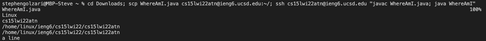

# Lab Report №1

This is a short tutorial on how to log into a course-specific account on **ieng6**.

## Installing VScode
The first step we are going to take is installing Visual Studio Code on our local computers. One can do it by using [this link](https://code.visualstudio.com/download). When you click the link you should see something like this:

After installing VS code and agreeing to appropriate license conditions, you should be able to open a window similar to the screenshot below:

Now we are ready to move on.

## Remotely Connecting

Since my laptop runs on Mac operating system I will cover the steps required for Mac users to connect to **ieng6**. Here they are:

* Go to [this](https://sdacs.ucsd.edu/~icc/index.php) website and look for your CSE15L course-specific account. Follow the steps described on the website. ***On the last step, when trying to change password, press "enter" on your keyboard instead of clicking on the button. This issue took me almost a day to resolve, so be careful!***

* Next open a terminal in VScode (hotkey shortcut: "control" + "shift" + "~");

* Type in `ssh cs15lwi22ant@ieng6.ucsd.edu` (instead of "ant" you should have some other letters) and enter your Password.

If you do everything correctly, you should get the following output in a terminal:

**Note**: *You might get an "authenticity of host..." message. It's fine, you just need to type "yes" there.*

## Trying Some Commands

Now we will try some commands:

* `cd` – change directory. If we type in just cd it will go to **home** directory;

* `cd <name>` – goes to other directory;

* `ls` – shows a list of files and directories in the given directory;

* `ls -a` – list of files and directories in the given directory including hidden ones that start with ".";

* `mkdir <nameOfFolder>` – creates a directory with a given name. 

Here is approximately what you should get:

**Note**: *There is a "Permission Denied" output in line 29 in screenshot, since I was trying to look into another student's directory.*

## Moving Files with **scp**

The next thing we are going to do is moving files from our **local** machine to **remote** ieng6. This can be done with the following line: `scp <FileName.java> cs15lwi22atn@ieng6.ucsd.edu~/`(don't forget about unique letters in **ieng6**). You should get something like this:

**Note**: *Don't forget to create a file on your local device first.*

At first when I ran WhereAmI file on my laptop, it showed me MAC OS X, my username, home directory and a path to download directory. After logging into ssh OS changed to Linux and home directory changed to another. 

## Setting an SSH Key

Now we will set up an SSH key, so that log in process would take less time. Here are the steps you should take:

1. On local device write: `ssh-keygen`;
2. Copy the path that is given to you in the next output and insert it as an input;
3. `ssh` to your **ieng6** account;
4. There right: `mkdir .ssh`;
5. Copy your public id_rsa to the `.ssh` directory: `scp /Users/stephengolzari/.ssh/id_rsa.pub cs15lwi22atn@ieng6.ucsd.edu:~/.ssh/authorized_keys`;
6. Log in once again :)

Screenshots of described above steps:

**Note**: *In the first screenshot you can see that I had to Overwrite my key since I already had it (I forgot to save the first-try screenshot). In your case you might not get this line.*

## Optimizing Remote Running

Finally, when using terminal and accessing **ieng6** we can insert a command in quotations and the whole line will run at once:

We can also use semicolons to run several commands:

Both of these techniques can be seen here:

I added "a line" string in the file on local network and could add this change to **ieng6**. It took me 150 keystrokes in order to run this line, including all letters and function keys("shift", "control, "enter"): first open a terminal using the hot key shortcut described above, then type in the line and press enter. 