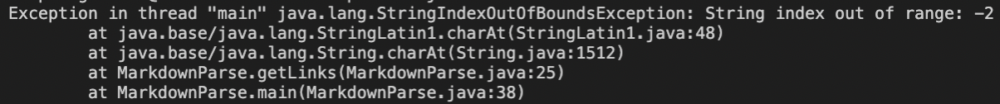

# Lab Report №2

This is a report on the second lab. 

## First Code Change

The first code change can be seen in the screenshot below:

The change corresponds to [this](https://github.com/Gossty/markdown-parse/blob/main/imagefirst.md) test file. They, in fact, are a responce to two errors, first is the output also including an image, when there should have been links only. Here is the output of running the file at the command line:

This printing of an image is a *symptom*, which indicates that there is a flaw in the program, a *bug*, resulting from an incorrect "definition" of a link that is given to the program: in the initial code a link is something that includes "`[ ] ( )`" and is the only thing that can include these symbols, however, the *failure-inducing input* shows us the opposite, that images also involve these symbols and, therefore, either image should be excluded as a variant or the overall "definiton" should be changed. My lab partners decided to solve this issue by checking whether symbol before `nextOpenBracket` is equal to `!`(second part of `if` condition at line 19) and changing `currentIndex` at line 20. 

However, when we did that we understood that this result in another *bug*: this solution would result in an error if the link is at the beginning of a file. A *failure-inducing input* for this case was [new-one.md](https://github.com/Gossty/markdown-parse/blob/main/new-one.md), while *symptom* is the following output in a terminal:

As it can be seen there is a `StringIndexOutOfBoundsException: String index out of range: -1`. This *symptom* resulted from the input means that there should be another `if` condition, which checks whether `nextOpenBracket` is equal to 0 and changes `currentIndex` if that condition is true. This can also be found on first screenshot, line 19-22.

## Second Code Change

The next code change:

The change corresponds to [this *failure-inducing input*](https://github.com/Gossty/markdown-parse/blob/main/test-file.md). The *symptom* of this input is next:

This results from the fact that at the end of a *failure-inducing input* there is an additional empty line at the end, and, since in `nextOpenBracket`, `indexOf` looks for `[` after `currentIndex`(line 14), the method returns -1, since there is no `[` after the given index. Then the program executes to line 22 on screenshot, and `charAt` throws an exception, since it gets -2 as an argument ( -1 + [-1] ). This *bug* can be fixed by adding lines 15 to 17 as on the screenshot. At these lines there is a check whether `nextOpenBracket` is equal to -1, and if this condition is true, the loop is stopped. 

## Third Code Change

Third change:

The change corresponds to [new-two.md](https://github.com/Gossty/markdown-parse/blob/main/new-two.md) test file. The *symptom* of this *failure-inducing input* is next:

This *bug* results from an assumption that there will be `(` in the file; when this symbol is not inside the file,  `markdown.indexOf("(", nextCloseBracket);` assigns -1 to `closeParen` and therefore at line 29 (screenshot), a substring cannot be created, since there cannot be a substring that ends with an index -1. Solution to the problem that we came up with on the lab is presented in lines 21-24 and is based on an assumption that if there is no open parenthesis, then there will be no closed parenthesis, though, now I think a better solution would be to check indexes of both paranthesis, since there might be an open parenthesis, but still no close parenthesis. 