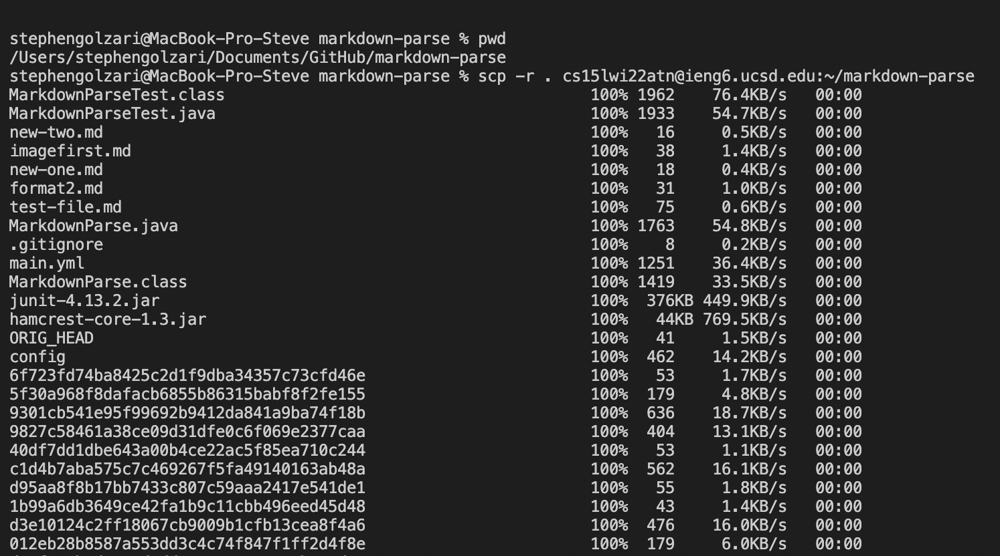
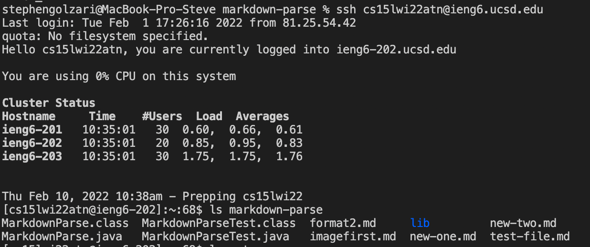
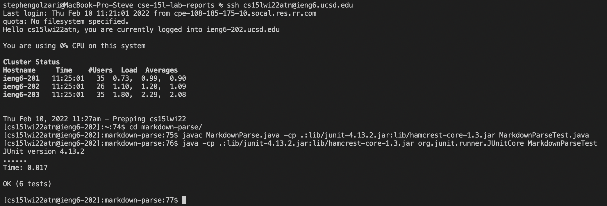
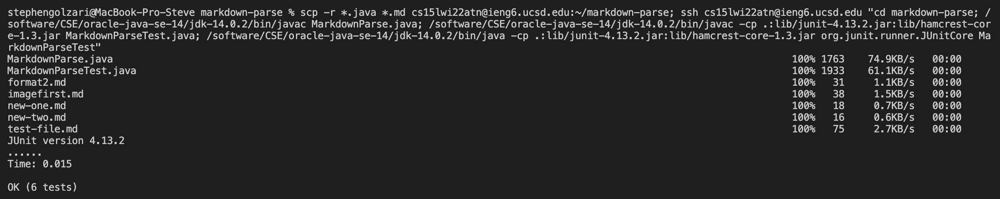

# Lab Report №3

This is a report for the lab on week 5. 

## Copy whole directories with `scp -r`

We have often worked with directories throughout this course, however we have not discussed how to copy the whole directory at once: if we use `scp` only, it would require copying each file from a directory to **ieng6** – this approach is lengthy and might result in errors. So, instead of `scp`-ing each file, one could simply use `scp -r`.

Here is how we can use `scp -r` to copy the whole directory to **ieng6** account by using `scp -r . cs15lwi22atn@ieng6.ucsd.edu:~/markdown-parse`:

When logging into **ieng6**, we can see that the folder was actually coppied:

Now we can compile and run the tests for my repository from **ieng6**:

Now we can get all the necessary commands in one line:

Notice that here I used `scp -r *.java *.md` at the beginning of the line. I did that in order to not copy all `.git` files inside the `markdown-parse` folder on **ieng6**. `*` indicates that all files with `java` and `md` extension should be copied. In the screenshot we can also see that all screenshots did run sucessfully. 
