# Lab Report №3

This is a report for the lab on week 7. 

This is [my repository](https://github.com/Gossty/markdown-parse)

This is [their repository](https://github.com/johnsonli010801/markdown-parse)

## Snippet 1

Turning first snippet into a test in ```MarkdownParseTest.java```:

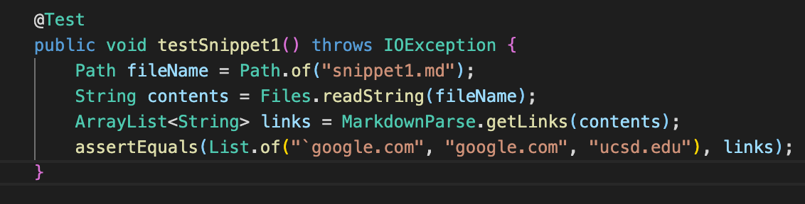

In the last line of the screenshot the expected output is seen.

My implementation resulted in this output when running the tests – the test resulted in an error:

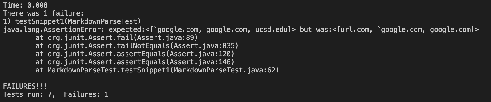

Other person's implementation resulted in the next output – the test also resulted in an error:

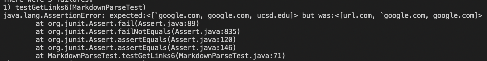

<!-- Do you think there is a small (<10 lines) code change that will make your program work for snippet 1 and all related cases that use inline code with backticks? If yes, describe the code change. If not, describe why it would be a more involved change. -->

Initially, I though that there is a way to fix the program with a small code change: checking for a backtick and ignoring everything (looking for neither `[` nor `]`) that is after it until the next backtick is met. The problem with this change is that backtick could be a part of a text, meaning that it could be met only once in the whole markdown file, therefore, the whole file would just be skipped. A fast solution could be either a restriction of backtick symbol usage anywhere except inline code or making everybody use three consecutive backticks when adding inline code (then we would just check whether there are three consecutive backticks or not).

## Snippet 2


Turning second snippet into a test in ```MarkdownParseTest.java```:

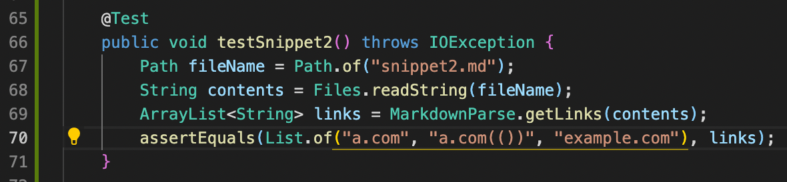

In line 71 in the screenshot the expected output is seen.

My implementation resulted in this output when running the tests – the test resulted in an error:

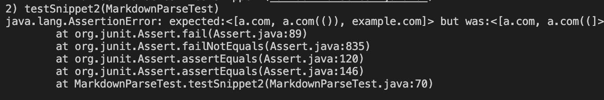

Other person's implementation resulted in the next output – the test also resulted in an error:

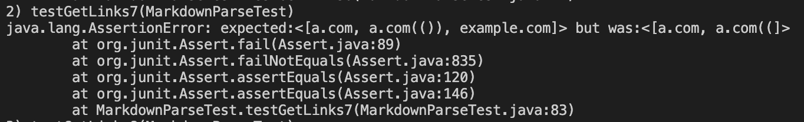


<!-- Do you think there is a small (<10 lines) code change that will make your program work for snippet 1 and all related cases that use inline code with backticks? If yes, describe the code change. If not, describe why it would be a more involved change. -->

For snippet 2, I think there is a small change in code that would make my program work: we could use a method to check brackets introduced by professor in lab 8, which was also modified by us on the lab. I am refering to these lines of code:

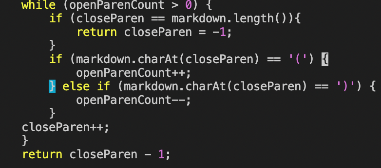

As it can be seen in the next screenshot it returns us the desired output:

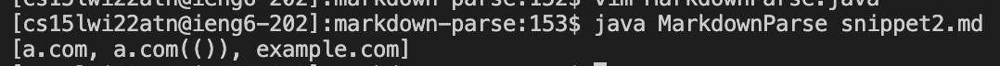

Although this helper method might not be a panacea, I could not find a failing inducing input, so, we can be sure that for most cases this small change would work.

## Snippet 3

Turning third snippet into a test in ```MarkdownParseTest.java```:

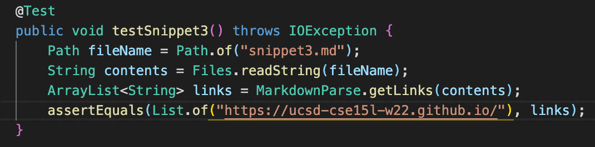

In line 71 in the screenshot the expected output is seen.

My implementation resulted in this output when running the tests – the test resulted in an error:

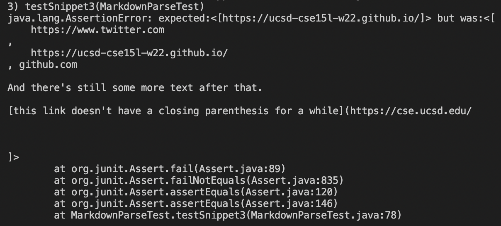

Other person's implementation resulted in the next output – the test also resulted in an error:

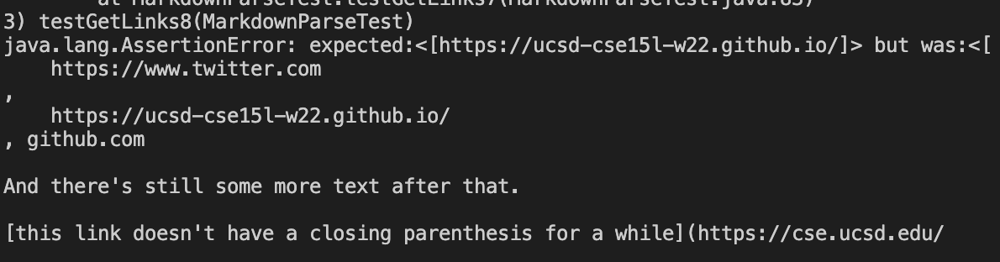

A change to the code could be made for these tests to run, however it does not seem to be small. If we take into consideration the previous addition suggested (the one in snippet 2), and add a counter of lines, then we could try this test work: markdown will make a link if the next open bracket is either on the same line or on the next one. We could count the number of lines between the open bracket and the closed one. If it is greater than one, then the program should just skip this link and not add it to the final arraylist. I was trying to implement this logic in the markdownparse, but I am not sure where and how exactly I should add the "skipping" of the link.


