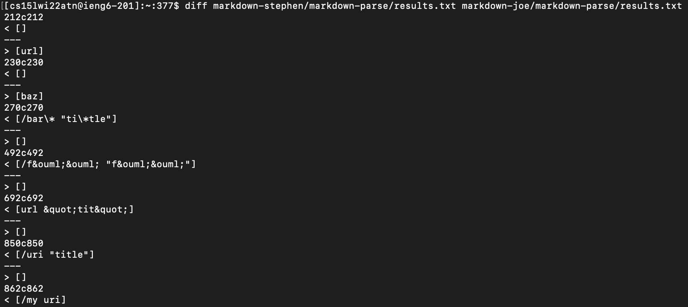
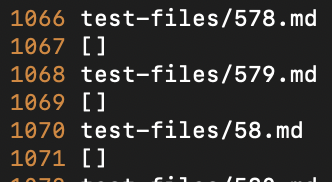
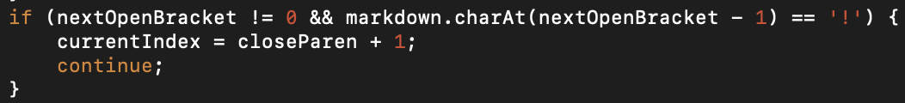
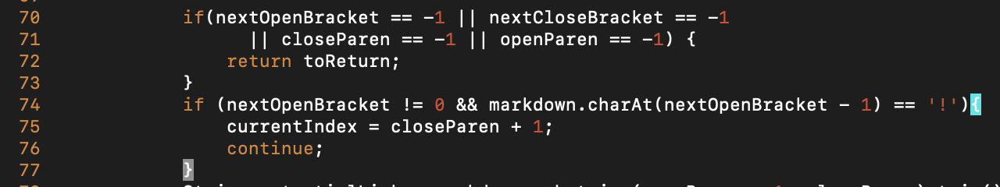

# Lab Report №5

This is a report for the lab on week 9.

In order to find different results we were using `diff`. Firstly, we have added all results into one `results.txt` file for both professors implementation and ours using `script.sh`:

```bash script.sh > results.txt```

After that we ran the following in our terminal:

```diff markdown-stephen/markdown-parse/results.txt markdown-joe/markdown-parse/results.txt ```

And in the end we got the next output:



In this screenshot we can see the differences between **outputs in some particular files** that we got from two implementations and the lines at which these outputs were found. Using the last information, we can find the exact file, in which the difference between implementation occurred.

For example, lets consider the output, where the difference is that one implementation returned `train.jpg`, while other returned nothing:
```
> [train.jpg]
1069c1066
< []
```
By looking through `results.txt` we can find that file at line 1066:



_Note: to see line number in Vim, use :set number._

Contents of `578.md`:
```
My 
```
Our implementation resulted in [] output, while professor’s gave [train.jpg]. Our output is correct, since in the file it’s not a link; it is an image. The reason why the bug occurred is, most probably, because the case when `!` is at the beginning of the link - it is an image, not a link. And this detail is not taken into consideration in professor's implementation. In order to resolve this problem, the following "if statement" could be added:



Adding this statement in `getLinks` method (the one that returns `ArrayList<String>`) would resolve this bug:




As we can see in the screenshot above, the last difference between the outputs of these files can be found 