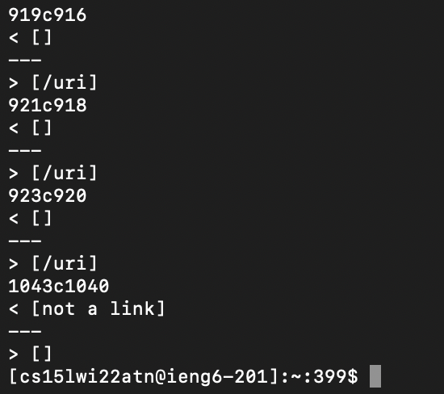
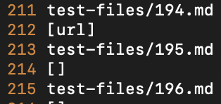
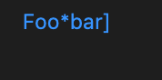
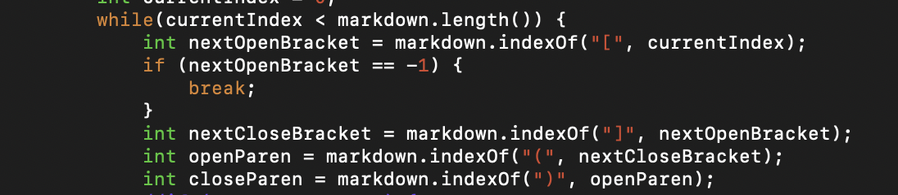

# Lab Report №5

This is a report of the lab on week 9.

In order to find different results we were using `diff`. Firstly, we have added all results into one `results.txt` file for both professors implementation and ours using `script.sh`:

```bash script.sh > results.txt```

After that we ran the following in our terminal:

```diff markdown-stephen/markdown-parse/results.txt markdown-joe/markdown-parse/results.txt ```

And in the end we got the next output:


In this screenshot we can see the differences between **outputs in some particular files** that we got from two implementations and the lines at which these outputs were found. Using the last information, we can find the exact file, in which the difference between implementation occurred.

## First bug

Lets consider the output, where the difference is that one implementation returned `train.jpg`, while other returned nothing:
```
> [train.jpg]
1069c1066
< []
```
By looking through `results.txt` we can find that file at line 1066:


_Note: to see line number in Vim, use :set number._

Contents of `578.md`:
```
My 
```

This is the output that markdown actually gives:


It is an image, hence should not be returned as a link.

Our implementation resulted in [] output, while professor’s gave [train.jpg]. Our output is correct, since in the file it’s not a link; it is an image. The reason why the bug occurred is, most probably, because the case when `!` is at the beginning of the link is not taken into consideration in professor's implementation. In order to resolve this problem, the following "if statement" could be added:


Adding this statement in `getLinks` method (the one that returns `ArrayList<String>`) at lines 74-76 in the screenshot would resolve this bug:


And after that we get the new output when doing `diff` (having previously updated the `results.txt` file in professor's implementation):



As we can see in the screenshot above, the last difference between the outputs of these files can be found at `1043c1040`, hence that bug is no longer present.

## Second bug

The other bug is at line 212, where one solution resulted in no link, while other returned `url`:

```
212c212
< []
---
> [url]
```

By looking through `results.txt` we can find that file at line 212:



Contents of `194.md`:

```
[Foo*bar\]]:my_(url) 'title (with parens)'

[Foo*bar\]]
```

This is the output markdown actually gives:



It is a link that when clicked redirects to `my_(url)`.

Our implementation resulted in [] output, while professor’s gave [url]. Both of these implementations are incorrect, as the resulted output should have been [my_(url)]. The problem in our code that results in this error is that the `getLink` method creates a link only in the cases when link is in `[]()` format. However, in this test case the given link is built by `[]:<link>'' \n []`. The whole method should be changed in order for this type of link to be added.

The main problem involved with this code is that colon is not even looked up in any way, therefore, the other type of a link could not even potentially be found.

The first change that I would propose is adding some sort of an "if statement" that would distinguish the two ways of how links can be made. Adding a variable that would save the result of a colon search would be a great way to start:



I suppose the most logical place for this change would be after we introduce `nextCloseBracket`, since a colon should be after a close bracket.